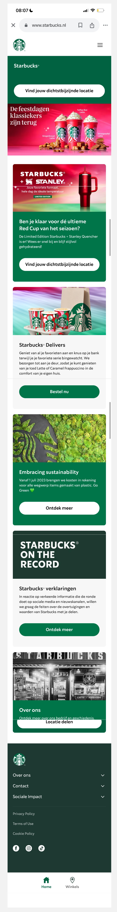
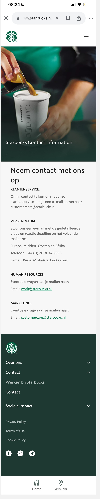
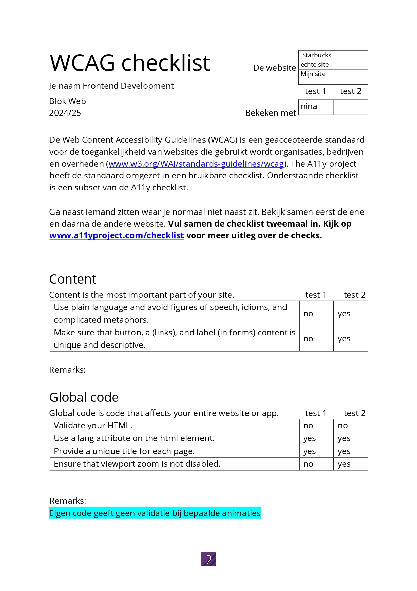
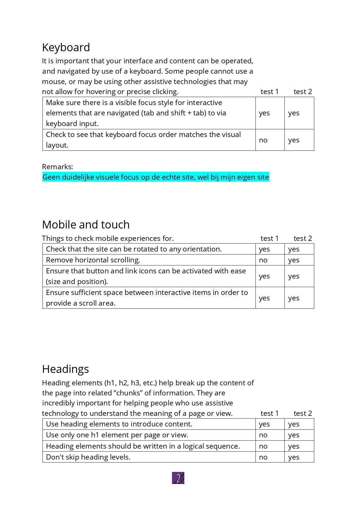
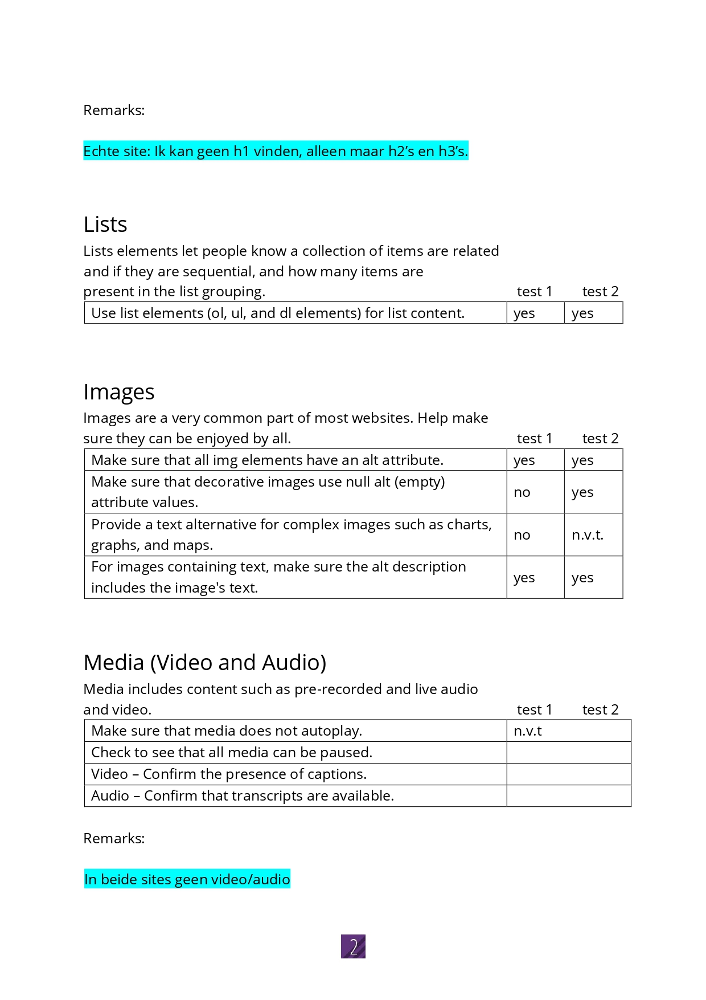
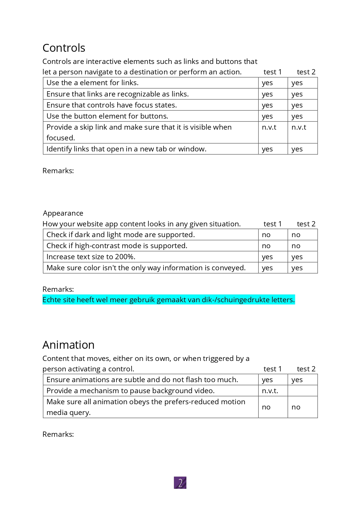
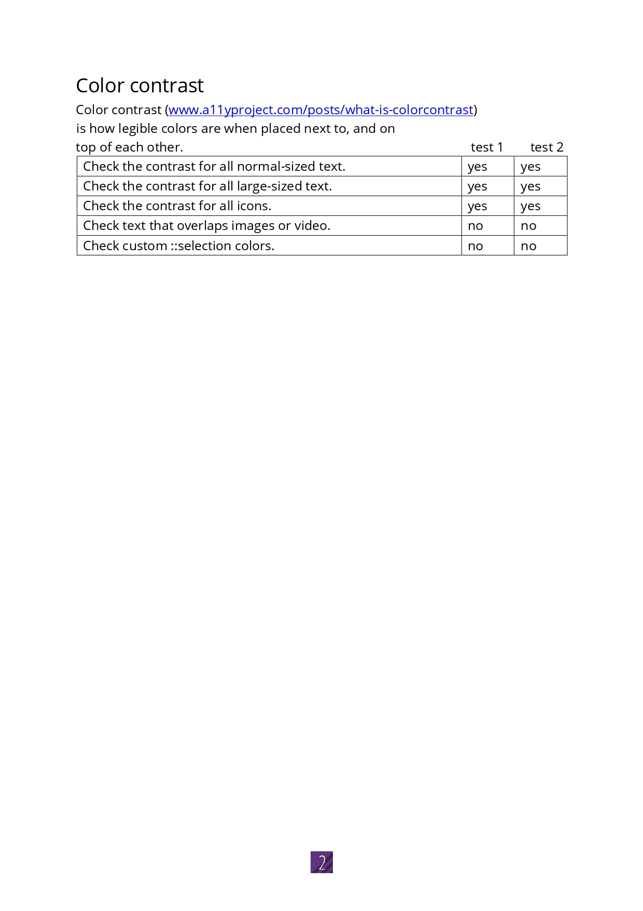

# Procesverslag
Markdown is een simpele manier om HTML te schrijven.  
Markdown cheat cheet: [Hulp bij het schrijven van Markdown](https://github.com/adam-p/markdown-here/wiki/Markdown-Cheatsheet).

Nb. De standaardstructuur en de spartaanse opmaak van de README.md zijn helemaal prima. Het gaat om de inhoud van je procesverslag. Besteedt de tijd voor pracht en praal aan je website.

Nb. Door *open* toe te voegen aan een *details* element kun je deze standaard open zetten. Fijn om dat steeds voor de relevante stuk(ken) te doen.

## Jij

  
uitwerken voor kick-off werkgroep

  ### Auteur:
  Sharena Diesveld

  #### Je startniveau:
  Blauwe piste

  #### Je focus:
  ik kies voor surface plane
 

## Je website

  
uitwerken voor kick-off werkgroep

  ### Je opdracht:
  https://www.starbucks.nl/nl

  #### Screenshot(s) van de eerste pagina (small screen): 
  Starbucks - Homepagina 
  

  #### Screenshot(s) van de tweede pagina (small screen):
  Starbucks - Contact  
  
 

## Toegankelijkheidstest 1/2 (week 1)

  
uitwerken na test in 2e werkgroep

  ### Bevindingen
  weinig animaties, responsive.
  screenreader leest de afbeeldingen ook voor en alle html elementen.plain language wordt gebruikt. duidelijke hierarchie. headings worden duidelijk gebruikt.

## Voortgang 1 (week 2)

  
uitwerken voor 1e voortgang

  ### Stand van zaken
  aantal keer geswitched van site. nu kiezen tussen paginas van starbucks.

  ### Verslag van meeting
  ik ben steeds tussen website geswitched. Ik wilde eerst de website van pinkpop gaan doen, maar dat was nog iets te hoog gegrepen voor mij. Toen kreeg ik van de studentassistent de tip dat veel studenten eerder de site van dunkin donuts hebben nagemaakt. Dat vond ik dan ook weer een beetje onorigineel, maar ik ben gaan kijken naar een soortgelijke site en toen heb ik gekozen voor starbucks.

## Voortgang 2 (week 3)

  
uitwerken voor 2e voortgang

  ### Stand van zaken
  Bezig met stylen homepagina, ook Ali om hulpm gevraagd > zie bronvermelding

  ### Verslag van meeting
  hier na afloop snel de uitkomsten van de meeting vastleggen

  -  ik had moeite met de fotos mooi uit laten komen in de articles. Toen kreeg ik van de studentassistent de tip om de fotos boven de articles te zetten ipv erin. toen snapte ik de styling ook beter.

## Toegankelijkheidstest 2/2 (week 4)

  
uitwerken na test in 9e werkgroep

  ### Bevindingen
  screenreader leest de afbeeldingen nogsteeds voor en alle html elementen. headings worden voorgelezen door de sreenreader. list elements zijn aanwezig.

## Voortgang 3 (week 4)

  
uitwerken voor 3e voortgang

  ### Stand van zaken
  andere tweede pagina maken dan gepland

  ### Verslag van meeting
  met de studentassistent en vasilis gesproken over welke tweede pagina ik kon maken. alles leek te veel op de homepage, dus vasilis zei dat ik de contact pagina kon maken en dan een formulier bijvoorbeeld zelf kon toevoegen.

## Eindgesprek (week 5)

  
uitwerken voor eindgesprek

  ### Dit was lastig/Is niet gelukt:
  Ik had meer animaties willen toevoegen, maar ben er niet aan toegekomen. Heb wel gebruik kunnen maken van positionering. Ook van nieuwe elementen zoals form, dat had ik nog niet eerder gebruikt.
  ik had eigenlijk nog feedback willen toevoegen na het verzenden van de form. daar ben ik helaas niet aan toe gekomen

## FEEDBACK voor herkansing
  
Wat ga ik aanpassen na het eerste mondeling?

  ### Ontvangen feedback Vasilis
  - Zorg er voor dat je met een screen reader alle headings en alle links kunt laten voorlezen.
  - Neem de toegankelijkheidstests serieus! Er zijn nu erg weinig bevindingen, en ik mis de foto's van je WCAG formulier.
  - Voeg meer mooie en toffe dingen toe. Kijk bijvoorbeeld naar animaties, transities, states, gradients. Er zijn allemaal toffe en mooie dingen die je kunt toevoegen.

  ### Wat heb ik aangepast?
  Ik heb het WCAG formulier opnieuw en serieuzer ingevuld en heb er samen naar gekeken met Nina. Ook heb ik animaties toegevoegd die ik in de oefeningen tijdens de lessen geleerd heb, ik was daar vorige keer niet aan toe gekomen. En verder heb ik geoefend om beter met de screenreader te werken; Door de pijlen op mijn toetsenbord te gebruiken.
  
  
  ### WCAG
  Wat opviel bij de echte starbucks site is dat ik heen h1 terug kon vinden in de code met de screenreader of als ik door de code las. Er was geen mooie volgorde van kopjes, op sommige pagina's stond de h3 boven de h2. Ook lijkt bij de validatie van mijn eigen code een probleem te zijn met een aantal animaties, maar Nina zei tegen me dat dat geen probleem is in dit geval. Ik had het liever willen fixen natuurlijk want de code hoort wel gewoon valid te zijn. Verder vind ik dat de echte site niet geheel toegankelijk is, omdat het ook wel een veel complexere code heeft dan mijn site, en daarom scoort de echte site wel iets minder goed op het WCAG formulier.

  
  
  
  
  

## Bronnenlijst

  
continu bijhouden terwijl je werkt

  1. Homepagina nav hamburger menu: Ali heeft me geholpen met het stylen van de button, hoe ik bijvoorbeeld span kon gebruiken om die drie streepjes te krijgen. En ook uitgelegd hoe ik deze met JS kon laten werken. ook met de javascript die is gekoppelt aan de nav heeft hij geholpen hoe ik het kon coderen.
  2. Anouk heeft me geholpen met het stylen van de form in mijn contact pagina. Ze gaf me ook tips over hoe ik een class kon gebruiken in de contact pagina om de css van de homepagina te kunnen overschrijven.
  3. vasilis gevraagd hoe de eerste afbeelding op de home het hele scherm kon vullen. (margin-inline-start)
  4. Ali heeft geholpen met hoe ik de css sections kon overschrijven met class in de tweede pagina.
  5. Nina heeft me geholpen bij de spinner draai-animatie van het logo.

